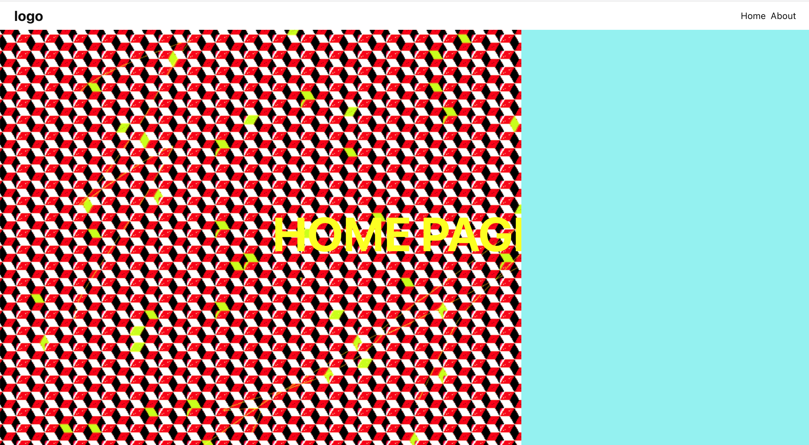

[LIVE DEMO](https://mattheweq.com/page-transitions-2/)



### A react component which animates a left to right wipe transition using GSAP.

#### See: `global.css` for styling variations.

### Simply place the Transition component above the DOM content/JSX of any page/route component you want the affect to apply to. The transition will then occur as the user navigates around your website/app.


### To deploy react app to gh pages add the following :
```
"homepage": "https://matthew-via-music.github.io/page-transitions-2",

"scripts": {
  "predeploy": "npm run build",
  "deploy": "gh-pages -d build",
  ...
}

run-> npm run deploy
```

---
[deploy react app to gh pages](https://github.com/gitname/react-gh-pages)
